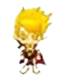

# La OrcoCueva by Family.Game

## Equipo de desarrollo

- Jofre Jonatan
- Pasquali Agustin
- Perugini Pablo
- Zamorano Burgoa Daniel

## Capturas

## Reglas de Juego / Instrucciones

El objetivo del juego es agarrar la llave y abrir el cofre, para esto deberemos desplazarnos por el mapa con las flechas del teclado.
La llave, las pociones y el cofre interactuan con nuestro gerrero cuando este las pisa (es decir se encuentran en la misma ubicacion).
En el mapa encontraremos unos orcos feroces que intentaran choca su cabeza contra nosotros. Para eliminarlos deberemos presionar la tecla espacio (space) y generaremos una bola de choque con nuestra espada sagrada.
Si el jugador pierde las 3 vidas al chocar con un orco, este perdera (no hablamos en la primera persona del plural porque nosotros no perdemos!)
Esperamos que lo disfrute!

## Otros

- Programacion orientada a Objetos I, Universidad Nacional de Hurlingham
- Versión de wollok: 3.0.0
- Una vez terminado, no tenemos problemas en que el repositorio sea público.
